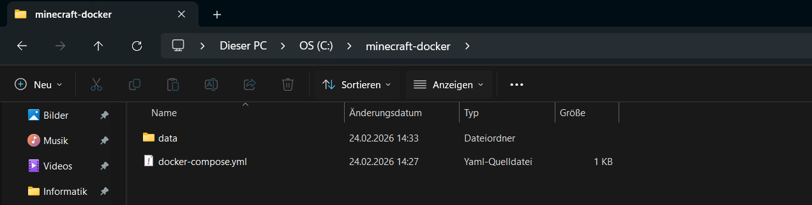

# M300-STE


### 3. GitHub Account & Repository
3.1 GitHub Account

https://github.com
 aufrufen

Benutzerkonto erstellen
E-Mail bestätigen
Anmelden

3.2 Repository erstellen
Neues Repository erstellen
Name: m300-STE
Public
Initialize with README
Repository erstellen

4. Git Bash installieren & konfigurieren
4.1 Installation

Git für Windows herunterladen: https://git-scm.com
Installation mit Standardeinstellungen
Git Bash öffnen

4.2 Git konfigurieren
git config --global user.name "USERNAME"
git config --global user.email "EMAIL"

5. SSH-Key für GitHub
5.1 SSH-Key erstellen
ssh-keygen -t ed25519 -C "EMAIL"
Speicherort: Enter
Passwort: optional

5.2 Public Key anzeigen
cat ~/.ssh/id_ed25519.pub

5.3 SSH-Key zu GitHub hinzufügen
GitHub → Profilbild → Settings
SSH and GPG keys
New SSH key
Key einfügen und speichern

6. Repository lokal klonen
cd /c
git clone git@github.com:USERNAME/m300-STE.git
cd m300-STE

7. VirtualBox installieren
Download: https://www.virtualbox.org
Installation mit Standardoptionen
Neustart empfohlen

8. Vagrant installieren
Download: https://www.vagrantup.com
Installation mit Standardoptionen
Test:
vagrant --version

9. Vagrant-Projekt erstellen
cd /c/m300-STE
mkdir vagrant
cd vagrant
vagrant init

10. Apache Webserver automatisiert einrichten
10.1 Vagrantfile konfigurieren
Das Vagrantfile wird so angepasst, dass:
Ubuntu Jammy verwendet wird
Apache automatisch installiert wird
Port 8080 (Host) auf 80 (VM) weitergeleitet wird
/vagrant als Webroot dient

Finales funktionierendes Vagrantfile
Vagrant.configure("2") do |config|
  config.vm.box = "ubuntu/jammy64"
  config.vm.boot_timeout = 600

  # Portweiterleitung Host 8080 → VM 80
  config.vm.network "forwarded_port",
    guest: 80,
    host: 8080,
    host_ip: "127.0.0.1",
    auto_correct: true

  # Apache installieren und konfigurieren
  config.vm.provision "shell", inline: <<-SHELL
    set -e
    apt-get update -y
    apt-get install -y apache2

    # /vagrant als Webroot
    sed -i 's#DocumentRoot /var/www/html#DocumentRoot /vagrant#g' \
      /etc/apache2/sites-available/000-default.conf

    # Zugriff erlauben
    if ! grep -q "<Directory /vagrant>" /etc/apache2/apache2.conf; then
      cat >> /etc/apache2/apache2.conf <<EOF

<Directory /vagrant>
  Options Indexes FollowSymLinks
  AllowOverride All
  Require all granted
</Directory>
EOF
    fi

    a2enmod rewrite
    systemctl restart apache2
  SHELL
end

11. VM starten
vagrant up


Status prüfen:

vagrant port


Erwartetes Resultat:

80 (guest) => 8080 (host)
22 (guest) => 2222 (host)

12. Apache testen
12.1 HTML-Datei erstellen (Host)
cd /c/m300-STE/vagrant
echo "<h1>Hallo Apache</h1>" > index.html

12.2 Browser öffnen

http://127.0.0.1:8080

Der Text „Hallo Apache“ wird angezeigt.

13. VM beenden / löschen
vagrant destroy -f


------------------------------------------------------------------------------------------------------------------------------------------------------------


### 02 - Infrastruktur
# Cloud Computing, Infrastructure as Code, Vagrant, Packer und AWS

## 1. Cloud Computing

Cloud Computing (Rechnerwolke) bezeichnet die Ausführung von Programmen und die Nutzung von IT-Ressourcen, die nicht lokal installiert sind, sondern auf entfernten Systemen (remote) betrieben werden. Der Zugriff erfolgt über ein Netzwerk – meist das Internet – mittels technischer Schnittstellen, Protokolle oder über den Webbrowser.

Technisch beschreibt Cloud Computing den Ansatz, IT-Infrastrukturen wie Rechenleistung (Compute), Datenspeicher (Storage), Netzwerkkapazitäten (Networking), Sicherheitsmechanismen oder sogar vollständige Softwarelösungen über ein Netz bereitzustellen, ohne dass diese lokal installiert oder betrieben werden müssen.

Die Spannweite der angebotenen Dienstleistungen umfasst das gesamte Spektrum der Informationstechnologie und wird typischerweise in drei Hauptmodelle unterteilt:

- Infrastructure as a Service (IaaS)
- Platform as a Service (PaaS)
- Software as a Service (SaaS)

Mit der Einführung von Container-Technologien entstand zusätzlich eine weitere Ebene: Container as a Service (CaaS).

---

## 2. Service-Modelle im Cloud Computing

### 2.1 Infrastructure as a Service (IaaS)

IaaS stellt die unterste Schicht im Cloud Computing dar und wird auch als „Cloud Foundation“ bezeichnet. Hier erhält der Benutzer Zugriff auf virtuelle Maschinen, Netzwerke und Speicher, verwaltet diese jedoch selbstständig.

Typische Aufgaben des Benutzers bei IaaS:
- Erstellen und Konfigurieren von virtuellen Maschinen
- Installieren von Betriebssystemen
- Einrichten von Firewalls
- Verwalten von Updates und Sicherheitsrichtlinien

Der Cloud-Anbieter stellt lediglich die Infrastruktur bereit, während die Verantwortung für Konfiguration und Wartung weitgehend beim Benutzer liegt.

---

### 2.2 Platform as a Service (PaaS)

Bei PaaS entwickelt der Benutzer eine Anwendung und lädt diese in die Cloud-Plattform hoch. Die Plattform übernimmt automatisch:
- Verteilung auf Recheneinheiten
- Skalierung
- Ressourcenverwaltung

Der Benutzer hat keinen direkten Zugriff auf virtuelle Maschinen und betreibt keine Server selbst. Die Infrastruktur ist vollständig abstrahiert.

---

### 2.3 Software as a Service (SaaS)

SaaS stellt die höchste Abstraktionsebene dar. Der Benutzer nutzt eine bestehende Anwendung, die vom Cloud-Anbieter bereitgestellt wird. Er muss sich weder um Infrastruktur noch um Skalierung oder Datenhaltung kümmern.

Beispiele hierfür sind webbasierten Anwendungen, bei denen nur ein Browser benötigt wird.

---

### 2.4 Container as a Service (CaaS)

Mit der Containerisierung durch Docker entstand zwischen IaaS und PaaS eine zusätzliche Ebene: CaaS.

Containerisierte Anwendungen werden auf IaaS-Ressourcen ausgeführt. Technologien wie Docker oder Kubernetes ermöglichen eine flexible und portable Ausführung von Anwendungen.

Ein großer Vorteil: Da diese Technologien quelloffen sind, kann eine private Cloud ohne Vendor Lock-in aufgebaut werden.

---

## 3. Dynamic Infrastructure Platforms

Eine dynamische Infrastruktur-Plattform virtualisiert und verwaltet Rechenressourcen programmgesteuert. Dazu gehören:

- CPU (Compute)
- Speicher (Storage)
- Netzwerke (Networking)

Die Ressourcen werden on-demand bereitgestellt und über APIs gesteuert.

### Beispiele

Public Cloud:
- AWS
- Azure
- Digital Ocean
- Google
- Exoscale

Private Cloud:
- CloudStack
- OpenStack
- VMware vCloud

Lokale Virtualisierung:
- Oracle VirtualBox
- Hyper-V
- VMware Player

Hyperkonvergente Systeme kombinieren diese Funktionen in einer Hardwarelösung.

---

### Anforderungen für IaC

Damit Infrastructure as Code genutzt werden kann, muss eine Plattform:

- programmierbar (API) sein
- on-demand Ressourcen bereitstellen
- Self-Service ermöglichen
- portabel (anbieterunabhängig) sein
- Sicherheitsstandards erfüllen (z.B. ISO 27001)

---

## 4. Infrastructure as Code (IaC)

### 4.1 Historische Entwicklung

Früher waren IT-Systeme physisch an Hardware gebunden. Bereitstellung und Wartung waren manuell und zeitintensiv. Änderungen waren teuer und riskant.

Heute sind Systeme virtualisiert und von Hardware entkoppelt. Infrastruktur kann automatisiert erstellt, geändert oder zerstört werden.

---

### 4.2 Definition

Infrastructure as Code ist ein Paradigma zur Infrastruktur-Automation basierend auf Best Practices der Softwareentwicklung.

Infrastruktur wird:
- als Code definiert
- versioniert
- getestet
- automatisch ausgerollt

Statt manuelle Konfiguration erfolgt die Bereitstellung reproduzierbar und konsistent.

---

### 4.3 Best Practices

IaC nutzt Methoden aus der Softwareentwicklung:

- Versionsverwaltung (VCS)
- Testgetriebene Entwicklung (TDD)
- Continuous Integration (CI)
- Continuous Delivery (CD)

---

### 4.4 Ziele von IaC

- Infrastruktur unterstützt Veränderungen
- Änderungen werden Routine
- Schnellere Wiederherstellung von Systemen
- Kontinuierliche Verbesserung
- Reduktion manueller Fehler
- Fokus auf wertschöpfende Tätigkeiten

---

### 4.5 Tool-Kategorien

Infrastructure Definition Tools:
- OpenStack
- Terraform
- CloudFormation

Server Configuration Tools:
- Vagrant
- Packer
- Docker

Package Management:
- APT
- YUM
- WiX

Scripting:
- Bash
- PowerShell

Versionsverwaltung & Hubs:
- GitHub
- Docker Hub
- Vagrant Boxes

---

## 5. Vagrant

Vagrant ist eine Open-Source-Ruby-Anwendung zum Erstellen und Verwalten virtueller Maschinen. Es dient als Wrapper zwischen Virtualisierungssoftware (VirtualBox, VMware, Hyper-V) und Konfigurationswerkzeugen.

Virtuelle Maschinen entsprechen vollständigen Servern.

### Wichtige Befehle

```bash
vagrant init
vagrant up
vagrant ssh
vagrant status
vagrant port
vagrant halt
vagrant destroy -f
```

### Beispiel Vagrantfile

```ruby
Vagrant.configure("2") do |config|
  config.vm.box = "ubuntu/xenial64"
  config.vm.hostname = "srv-web"
  config.vm.network :forwarded_port, guest: 80, host: 8080

  config.vm.provision :shell, inline: <<-SHELL
    sudo apt-get update
    sudo apt-get -y install apache2
  SHELL
end
```


### Workflow

```bash
mkdir myserver
cd myserver
vagrant init ubuntu/xenial64
vagrant up
vagrant status
```

Synced Folder:

```ruby
config.vm.synced_folder ".", "/var/www/html"
```

Standardmäßig wird das Projektverzeichnis unter `/vagrant` gemountet.

---

## 6. Packer

Packer erstellt Images bzw. Boxen für verschiedene Plattformen mittels JSON-Konfiguration.

Wichtigster Befehl:

```bash
packer build template.json
```

Packer besteht aus:

- Builder (erstellt VM)
- Provisioners (führen Skripte aus)
- Post-Processors (erzeugen Artefakte wie Vagrant-Boxen)

### Installation

```bash
sudo mkdir ~/packer
cp packer ~/packer
export PATH="$PATH:/Users/username/packer"
packer
```

Packer lädt eine ISO-Datei, installiert das Betriebssystem automatisiert (z.B. PreSeed), führt Konfigurationsskripte aus und erzeugt eine Vagrant-Box.

---

## 7. AWS Cloud

AWS ist eine Public-Cloud-Plattform mit globalen Rechenzentren.

Wichtige Konzepte:

- Root Account (Vollzugriff)
- Regionen (z.B. Frankfurt)
- IAM User (Rechteverwaltung)
- Security Groups (Port-Regeln)
- Key Pairs (SSH-Zugriff)
- AMIs (Images)

### Vagrant + AWS

Plugin installieren:

```bash
vagrant plugin install vagrant-aws
```

Dummy Box:

```bash
vagrant box add dummy https://github.com/mitchellh/vagrant-aws/raw/master/dummy.box
```

Beispiel config.rb:

```ruby
$aws_options = {}
$aws_options[:access_key] = ""
$aws_options[:secret_key] = ""
$aws_options[:ec2_keypair] = "aws-key.pem"
$aws_options[:region] = "eu-central-1"
$aws_options[:ami_id] = "ami-xxxx"
$aws_options[:instance_type] = "t2.micro"
$aws_options[:security_group] = "WebServer"
```

Start:

```bash
vagrant up web --provider=aws
```

---

## 8. Zusammenfassung

Cloud Computing ermöglicht die Nutzung von IT-Ressourcen über Netzwerke statt lokal. Dynamic Infrastructure Platforms stellen virtualisierte Ressourcen bereit. Infrastructure as Code automatisiert deren Bereitstellung mittels Code.

Vagrant ermöglicht lokale VM-Umgebungen, Packer erstellt reproduzierbare Images und AWS stellt skalierbare Public-Cloud-Infrastruktur bereit.

Grundvoraussetzung für IaC sind programmierbare, on-demand verfügbare, portable und sichere Plattformen.


# Fragen & Antworten – Cloud Computing, IaC und Vagrant

## Cloud Computing

**Was versteht man unter Cloud Computing?**  
Ausführung von Programmen auf entfernten Systemen (remote), die über ein Netzwerk wie das Internet genutzt werden, statt lokal installiert zu sein.

**Was versteht man unter Infrastructure as a Service (IaaS)?**  
Unterste Schicht im Cloud Computing. Der Anbieter stellt Infrastruktur (VMs, Netzwerk, Speicher) bereit, der Benutzer verwaltet seine virtuellen Maschinen selbst.

---

## Infrastructure as Code (IaC)

**Was ist der Unterschied zur manuellen Installation einer VM?**  
Automation, Wiederholbarkeit und Dokumentation durch Code statt manuelle Konfiguration.

---

## Vagrant

**Was wird mit Vagrant erzeugt?**  
Virtuelle Maschinen.

**Welche der Aussagen treffen zu?**  
a) Vagrant ist ein Hypervisor  
b) Vagrant erzeugt virtuelle Maschinen und unterstützt mehrere Hypervisor und Cloud-Umgebungen (z.B. AWS)  
c) Vagrant erzeugt Container  

**Antwort:**  
b)

**In welchen Bereich des Cloud-Computings ist Vagrant einzuordnen?**  
IaaS

**Welche Alternativen zu Vagrant bestehen?**  
https://alternativeto.net/software/vagrant/

**Wo speichert Vagrant seine Konfiguration?**  
Im Vagrantfile.

**Was bedeutet die Fehlermeldung "A Vagrant environment or target machine is required to run this command."?**  
Man befindet sich im falschen Verzeichnis – es ist kein Vagrantfile vorhanden.

**Bei welcher LPI-Zertifizierung nützt mir das Vagrant-Wissen?**  
DevOps Tools Engineer (LPI)


# LB2 Hands-on – Automatisierung eines Serverdienstes mit Vagrant
Voraussetzungen
10 Toolumgebung
Mögliche Serverdienste für die Automatisierung
Neue VM zum Testen erstellen
Um einen Service zu automatisieren, ist es von Vorteil, eine VM zum Testen zu erstellen. In dieser können dann die Befehle manuell ausprobiert werden, bevor sie in Vagrantfile übertragen werden.

Zuerst erzeugen wir ein neues Verzeichnis mit einer Vagrantfile mit einem Ubuntu 16.x (ubuntu/xenial64).

cd myM300/
mkdir myVM
cd myVM
vagrant init ubuntu/xenial64
vagrant up
Zum Testen wechseln wir in die VM

vagrant ssh
Serverdienste auswählen
Anschliessend suchen wir uns die Serverdienste aus, welche wir automatisieren wollen. Dabei hilft diese Wikiseite von Ubuntu.

Wir haben uns für Webanalyzer entschieden, dazu braucht es jedoch auch den Apache Webserver.

Zuerst müssen immer die Paketquellen von Ubuntu aktualisiert werden, dies erfolgt als Superuser (Linux = root, Windows = Administrator)

sudo apt-get update
Dann folgt die Installation von Apache. Dabei darf das Argument -y nicht vergessen werden, ansonsten bleibt der Installationsbefehl stehen und verlangt vom User eine manuelle Eingabe.

sudo apt-get install -y apache2
Das/die Grundpaket(e) sind installiert, nun kümmern wir uns um den eigentlichen Service Webanalyzer

sudo apt-get install -y webalizer 
Wenn alles läuft, schauen wir uns mit history die gemachten Eingaben an und kopieren die relevanten Befehle in die Vagrantfile.

Feintuning
Probleme
Dateien sind nach dem Zerstören der VM nicht mehr vorhanden
Port vom Webserver, in der VM, wird nicht weitergeleitet an Host.
Es existiert keine index.html unter /var/www/webalizer/index.html. Siehe Hinweis bei Verwendung
Der URL (z.B. via curl http://localhost/webalizer) von Webanalyzer kann nicht abgerufen werden
Lösungen
Dateien und Port Weiterleitung

siehe Web Beispiel
Um einen Output zu Erzeugen sind mehrere Aktionen nötig:

Erzeugung von Trafic z.B. mittels curl http://localhost/ (PowerShell: Invoke-WebRequest)

curl http://localhost/ >/dev/null 2>&1
curl http://localhost/ >/dev/null 2>&1
curl http://localhost/ >/dev/null 2>&1
curl http://localhost/ >/dev/null 2>&1
curl http://localhost/bad >/dev/null 2>&1    
Rotieren des Access Logs von Apache, weil Webanalyzer nur Archivdaten auswertet. Siehe Hinweis bei Verwendung

sudo logrotate -f /etc/logrotate.d/apache2    
Korrektur des Output Verzeichnisses in /etc/webalizer/webalizer.conf

sudo sed -i -e"s:/var/www/webalizer:/var/www/html/webalizer:" /etc/webalizer/webalizer.conf 
Manuelle Erzeugung des Webanalyzer Ausgaben

sudo /etc/cron.daily/webalizer 
Das komplette Vagrantfile sieht dann so aus:

Vagrant.configure(2) do |config|
  config.vm.box = "ubuntu/xenial64"
  config.vm.network "forwarded_port", guest:80, host:8080, auto_correct: true
  config.vm.synced_folder ".", "/var/www/html"  
config.vm.provider "virtualbox" do |vb|
  vb.memory = "512"  
end
config.vm.provision "shell", inline: <<-SHELL
  # Packages vom lokalen Server holen
  # sudo sed -i -e"1i deb {{config.server}}/apt-mirror/mirror/archive.ubuntu.com/ubuntu xenial main restricted" /etc/apt/sources.list 
  # Debug ON!!!
  set -o xtrace  
  sudo apt-get update
  sudo apt-get -y install apache2 webalizer 
  sudo /etc/cron.daily/webalizer
  # Testdaten erzeugen
  curl http://localhost/ >/dev/null 2>&1
  curl http://localhost/ >/dev/null 2>&1
  curl http://localhost/ >/dev/null 2>&1
  curl http://localhost/ >/dev/null 2>&1
  curl http://localhost/bad >/dev/null 2>&1
  # Patch falsches Output Verzeichnis von webalizer 
  sudo sed -i -e"s:/var/www/webalizer:/var/www/html/webalizer:" /etc/webalizer/webalizer.conf 
  sudo mkdir -p /var/www/html/webalizer 
  # Logfiles von Apache rotieren und neue Analyse
  sudo logrotate -f /etc/logrotate.d/apache2
  sudo /etc/cron.daily/webalizer  
SHELL
end
Sicherheit
Die VW sollte zusätzlich mit einer Firewall abgesichert werden.

Ist die VM Teil mehrerer VMs bzw. Webservers, können diese mittels eines Reverse Proxies zu einem zusammengefasst werden (braucht nur ein SSL-Zertifikat).

Ein Beispiel dazu findet man unter fwrp und die Beschreibung unter 25 Infrastruktur-Sicherheit.


------------------------------------------------------------------------------------------------------------------------------------------------------------


### 03 – Docker & Containerisierung
1. Einführung in Container-Technologie

Container sind kein neues Konzept. Bereits in klassischen UNIX-Systemen existierten Mechanismen zur Isolation von Prozessen und Dateisystemen.

Historische Entwicklung
Jahr	Technologie	Bedeutung
1979	chroot	Dateisystem-Isolation
1998	FreeBSD Jails	Prozess- & Netzwerk-Isolation
2001	Solaris Zones	Vollständige OS-Container
2005	OpenVZ	Linux-Container (Open Source)
2008	LXC	Kombination von CGroups + Namespaces
2013	Docker	Vereinfachung & Mainstream

Erst durch Docker wurde Containerisierung massentauglich, da:

portable Images eingeführt wurden

eine einfache CLI bereitgestellt wurde

eine Registry (Docker Hub) entstand

2. Container vs. Virtuelle Maschinen
2.1 Virtuelle Maschine (VirtualBox / Vagrant)

vollständiges Betriebssystem

eigener Kernel

höherer Ressourcenverbrauch

langsamer Start

2.2 Container

teilen sich Kernel des Hosts

nur isolierte Prozesse

extrem leichtgewichtig

Start in Sekunden

Vergleich
VM	Container
Gigabyte gross	Megabyte gross
Minuten Startzeit	Sekunden
OS pro VM	Shared Kernel
Schwergewichtig	Leichtgewichtig

Docker ergänzt somit unsere bisherige VM-basierte Umgebung optimal.

3. Microservices

Einer der wichtigsten Treiber für Docker ist die Microservices-Architektur.

3.1 Monolithische Architektur

Ein grosses Programm

Vertikale Skalierung (mehr RAM, mehr CPU)

Alles oder nichts skalieren

3.2 Microservices Architektur

Kleine, unabhängige Services

Kommunikation über Netzwerk (HTTP/REST)

Horizontale Skalierung (mehr Instanzen)

Vorteile:

Bessere Skalierbarkeit

Fehlertoleranz

Technologiefreiheit pro Service

Effiziente Ressourcennutzung

Container sind ideal für Microservices, da jeder Service isoliert laufen kann.

4. Docker Architektur

Docker besteht aus zwei Hauptkomponenten:

4.1 Docker Daemon

Erstellt Images

Startet Container

Verwaltet Ressourcen

Läuft im Hintergrund

4.2 Docker Client

CLI-Tool (docker)

Kommuniziert via REST mit dem Daemon

Weitere Komponenten
Images

Unveränderbar

Vorlage für Container

Beispiel: ubuntu:22.04

Container

Laufende Instanz eines Images

Können gestartet, gestoppt und gelöscht werden

Docker Registry

Speicherort für Images

Standard: Docker Hub

Alternativ: Private Registry

5. Wichtige Docker Befehle
5.1 Container starten
docker run hello-world


Interaktive Shell:

docker run -it ubuntu /bin/bash


Detached (im Hintergrund):

docker run -d ubuntu sleep 20

5.2 Container anzeigen
docker ps
docker ps -a

5.3 Images anzeigen
docker images

5.4 Container löschen
docker rm container_name
docker rm -f $(docker ps -a -q)

5.5 Image löschen
docker rmi ubuntu

6. Dockerfile – Images selbst bauen

Ein Dockerfile beschreibt, wie ein Image erzeugt wird.

Beispiel Dockerfile
FROM ubuntu:22.04
RUN apt-get update && apt-get install -y apache2
EXPOSE 80
CMD ["apache2ctl", "-D", "FOREGROUND"]


Build:

docker build -t myapache .


Start:

docker run -d -p 8080:80 myapache

7. Netzwerk in Docker

Container sind isoliert. Um sie erreichbar zu machen, müssen Ports veröffentlicht werden.

Port Mapping
docker run -p 8080:80 nginx


Bedeutung:
Host-Port 8080 → Container-Port 80

Docker Netzwerke

Standard-Netzwerke:

bridge

host

none

Eigenes Netzwerk erstellen:

docker network create isolated_nw


Container mit Netzwerk verbinden:

docker run --network=isolated_nw ubuntu

8. Persistente Daten – Volumes

Standardmässig gehen Daten verloren, wenn ein Container gelöscht wird.

Lösung: Volumes

Volume erstellen:

docker volume create mysql


Container mit Volume starten:

docker run -v mysql:/var/lib/mysql mysql


Vorteile:

Daten bleiben erhalten

Container können neu gestartet werden

Trennung von Code & Daten

9. Image-Bereitstellung

Images können:

Neu gebaut werden (docker build)

Von Docker Hub geladen werden (docker pull)

Gepusht werden (docker push)

Exportiert werden (docker save)

Beispiel:

docker tag myimage username/myimage
docker push username/myimage

10. Bezug zur bisherigen Vagrant-Umgebung

In Kapitel 02 wurde Apache mittels Vagrant automatisiert installiert.

Docker bietet hier eine Alternative:

Statt:

VM starten

OS booten

Apache installieren

Reicht:

docker run -d -p 8080:80 nginx


Container sind:

Schneller

Ressourcenschonender

Einfach skalierbar

11. Sicherheit & Best Practices

Kein latest-Tag verwenden

Eigene Images versionieren

Container nicht als root laufen lassen

Nur benötigte Ports freigeben

Volumes für persistente Daten nutzen

12. Fazit

Docker revolutioniert die Art und Weise, wie Software bereitgestellt wird.

Durch:

Lightweight Container

Microservices-Architektur

Infrastructure as Code

Image-Registries

können Anwendungen schnell, skalierbar und reproduzierbar betrieben werden.

Im Vergleich zur klassischen Virtualisierung mit VirtualBox bietet Docker eine deutlich modernere und effizientere Lösung für Entwicklungs- und Produktionsumgebungen.


Projekt
